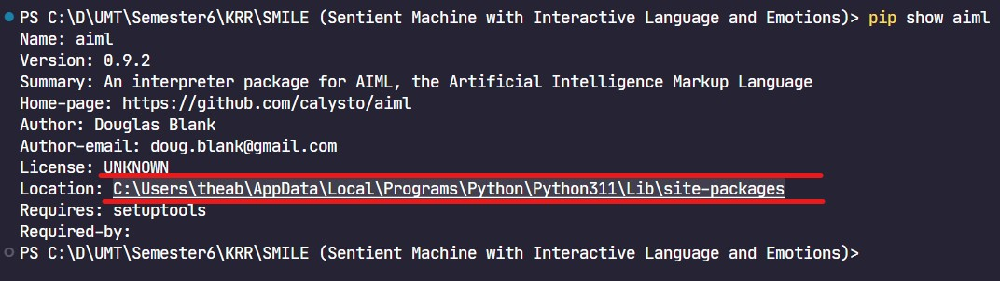
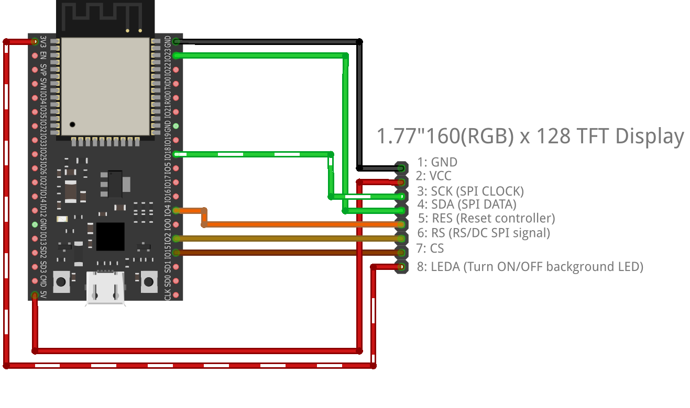

# Steps to setup SMILE

This file provides a clear and organized guide for setting up and running your project, both with and without speech functionalities.

## Without Speech

The following method is for running the project without speech functionalities.

### Prerequisites

- Python (v3.11.5)
- Neo4j Desktop

### Process

#### Setup Neo4j

1. Install Neo4j on Windows. [Watch the video tutorial](https://youtu.be/uUkBjrrBXN4?si=Ht_crZDPS-IC4jVx) (Duration: 5:32 mins)
2. Setup Neo4j:
    - Open Neo4j Desktop client
    - Create a database.
    - Paste the URL, username, and password in the `.env` file (`GRAPH_URL`, `GRAPH_USER`, `GRAPH_PASSWORD`).
    - Start the newly created Neo4j database.

#### Setup Python Environment

1. Download and Install Python:
    - Open a terminal.
    - Open a terminal in the main directory and run following command to download all libraries using `requirements.txt`:
      ```bash
      # Note: It will take some time to download the libraries.
      pip install -r requirements.txt
      ```
    - Run the command to load the SpaCy English model:
      ```bash
      python -m spacy download en_core_web_sm
      ```
    - Run the command to visit the "site-packages" directory:
      ```bash
      pip show aiml
      ```
    - Open the `aiml` directory in site-packages to find `Kernel.py`. Open `Kernel.py` and change `time.clock()` to `time.time()` in all occurrences.
      
#### Setup SMILE

1. Change your working directory to `app/`.
2. Run the following command to start SMILE.
    ```bash
    # Note: This will download the HuggingFace model only for the first time 
    # and will take a while to set up. After that, it will simply use the cached model.
    python.exe .\app.py
    ```
3. Visit [http://127.0.0.1:5000/register](http://127.0.0.1:5000/register) to register your user.

#### Start Chatting

---

## With Speech

The following method is for running the project with speech functionalities. Note that you will still need to do the whole setup mentioned above.

### Prerequisites

- Everything from the "Without Speech" portion
- [Espressif ESP32 Development Board](https://digilog.pk/products/espressif-esp32-wroom-32d-development-board)
- [ST7735 1.44 Inch 128x128 SPI TFT Color Screen LCD Display](https://digilog.pk/products/st7735-1-44-inch-128x128-color-screen-display)
- Jumper Wires
- USB-A to micro USB data cable
- MicroPython

### Process

#### Setup Hardware

1. Connect your ESP32 with the TFT display as shown below:
   
2. Connect your ESP32 with the computer using the USB-A to micro USB data cable.

#### Setup ESP32

1. **Install MicroPython on ESP32**: [Watch the video tutorial](https://youtu.be/fmgQ8Dcg9uM?si=ZKAkYDKFp1uMNLVx) (Duration: 4:23 mins)
2. Open a new terminal on your Windows machine (do not close the `app.py` terminal).
3. Change your working directory to `esp32/`.
4. Run the following command to upload TFT library and LCD code to ESP32.
    ```bash
    # Note: Input the communication port in capitals (e.g. **COM11**)
    python.exe .\upload.py
    ```
5. Open Thonny and select the commnication port from the bottom right. 
6. Run the `boot.py` on the ESP32 and enter your WiFi name and password.
7. Copy the IP address of ESP32 from the terminal.

#### Setup Speech

1. Change your working directory to the root folder of the project.
2. Run the following command to start speech functionality.
    ```bash
    # Note: Enter your username, password, and ESP32 IP address
    python.exe .\speech_handler.py
    ```

#### Start Chatting
---

